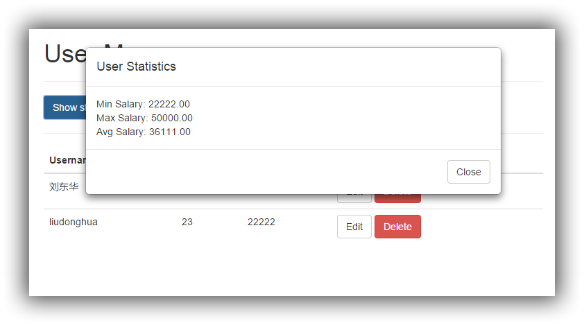

### SimpleWeb ###

#### 简介

这是一个简单的Java Web服务器端应用程序的Demo——展示一个非常简单的人员管理系统，人员有姓名、年龄、工资三项属性，有增加、删除、修改、查看、统计五项简单功能；使用纯Servlet实现RESTFul风格的服务器端CRUD操作，前端使用Bootstrap、Backbone等框架

#### 主要特性

- 纯Servlet方式处理请求
- RESTFul风格的请求格式，使用json作为数据传输格式
- 前端使用js mvc架构——backbone以及如jQuery、bootstrap等
- maven项目依赖库管理以及客户端bower依赖库管理
- 使用"response.addHeader("Access-Control-Allow-Origin", "*");"处理跨域请求

#### 使用方式

- 下载源码：git clone https://github.com/liudonghua123/simpleweb.git
- 使用Eclipse-import-maven project方式导入项目，会自动下载依赖库（如果下载失败也可以在命令行上执行mvn dependency:resolve）
- 在src/main/webapp目录下执行bower install下载前端依赖库
- 修改数据库连接配置文件：src/main/resources/db.properties，倒入数据库表结构及测试数据：src/main/resources/simpleweb.sql

#### 部分截图

